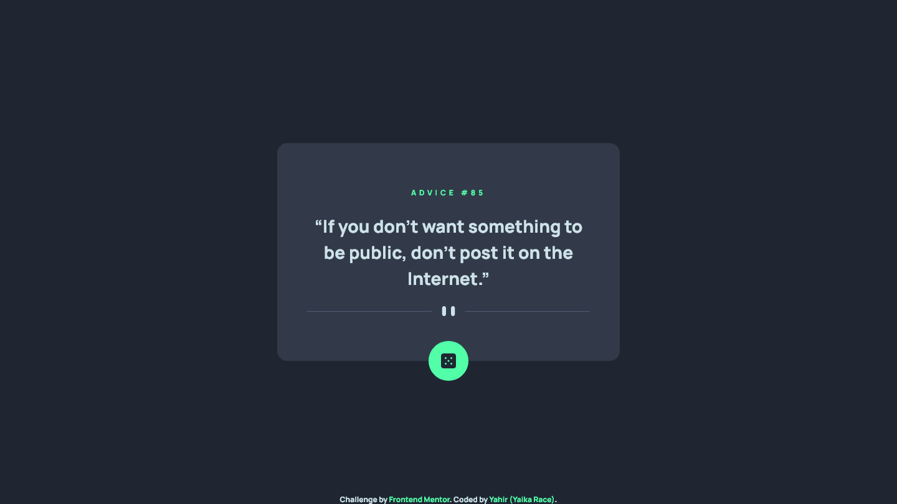

# Frontend Mentor - Advice generator app solution

This is a solution to the [Advice generator app challenge on Frontend Mentor](https://www.frontendmentor.io/challenges/advice-generator-app-QdUG-13db). Frontend Mentor challenges help you improve your coding skills by building realistic projects.

## Table of contents

- [Overview](#overview)
  - [The challenge](#the-challenge)
  - [Screenshot](#screenshot)
  - [Links](#links)
- [My process](#my-process)
  - [Built with](#built-with)
  - [What I learned](#what-i-learned)
  - [Continued development](#continued-development)
- [Author](#author)

## Overview

### The challenge

Users should be able to:

- View the optimal layout for the app depending on their device's screen size
- See hover states for all interactive elements on the page
- Generate a new piece of advice by clicking the dice icon

### Screenshot

### Links

- Live Site URL: [Add live site URL here](https://advice-generator-app-yaikarace.vercel.app)

## My process

### Built with

- Semantic HTML5 markup
- CSS custom properties
- Flexbox
- CSS Grid
- Mobile-first workflow
- JavaScript
- [Tailwind CSS](https://tailwindcss.com) - CSS Framework
- [Advice Slip API](https://api.adviceslip.com/) - API

### What I learned
I learned how to connect to an API from JavaScript and how to display the content received from an HTML element.
### Continued development
I will continue to learn about APIs and how to implement them in a web project.
## Author

- Frontend Mentor - [@YaikaRace](https://www.frontendmentor.io/profile/yaikarace)
- GitHub - [YaikaRace](https://github.com/yaikarace)
- YouTube Channel - [Yaika Race](https://youtube.com/c/yaikarace)
